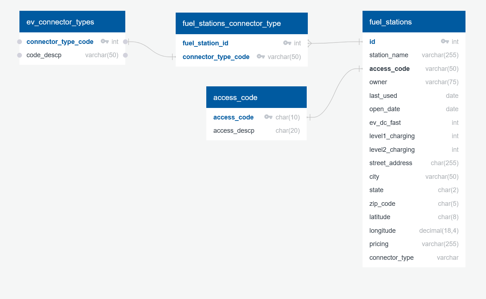

# Project 3 -  Electric Vehicle Charging Stations

We gathered electric vehicle charging station data from National Renewable Energy Laboratory (NREL) and U.S. Department of Energy (DOE) Alternative Fuels Data Center. We used the data to create a PostgreSQL database, a Flask API, and a dashboard web page with a variety of maps and graphs.

## Team Members
- Dawson Martin-Jones
- Daniel Montano
- Gboyega Adega
- Christopher Purcell

## Data
Our data was collected from [NREL Developer Network Alternative Fuel Stations](https://developer.nrel.gov/docs/transportation/alt-fuel-stations-v1/all/#request-url) and [U.S. Department of Energy (DOE) Alternative Fuels Data Center](https://afdc.energy.gov/corridors) for Electic Vehicle (EV) charging stations in the District of Columbia, Maryland, and Virginia. Additional reference data was also downloaded using the API. The data was cleaned using Python and Pandas and then exported to CSV and JSON files. The code to do this can be found in [`ExtractData.Dawson.ipynb`](/DataCollection/ExtractData.Dawson.ipynb), though you will need an API key from NREL stored in `config.py` to retrieve their data.

The National Renewable Energy Laboratory (NREL) and DOE Alterntive Fuels Data Center obtain their information about new stations from trade media, Clean Cities and Communities coalitions, the Submit New Station form on the Station Locator website, and through collaborating with infrastructure equipment and fuel providers, original equipment manufacturers (OEMs), and industry groups.

 Most existing stations in the database are contacted at least once a year on an established schedule to verify they are still operational and providing the fuel specified. Based on an established data collection schedule, the database is updated on an ongoing basis. Stations that are no longer operational or no longer provide alternative fuel are removed from the database as they are identified.

 [[Source]](https://afdc.energy.gov/stations#/find/nearest?show_about=true).
 

## DataBase
A PostgreSQL database was created using [`ev_charging_db_schema.sql`](postgres/ev_charging_db_schema.sql) and the CSV files in `Data/` to hold the charging station data along with the reference data.

Steps to Use:
1. Run the `CREATE TABLE` and `ALTER TABLE` queries from [`ev_charging_db_schema.sql`](postgres/ev_charging_db_schema.sql).
2. In pgadmin, use the import tool to import the csv files to the correct table
3. Run the test `SELECT` queries at the bottom of the sql file.

## Flask API
A Flask API was created to showcase retrieving our data from an API. Github pages only runs for static pages so Python and Flask can't be used directly with our website.

Steps to Use:
1. First create the SQLite database using [`generate_sqlite.py`](/flaskAPI/generate_sqlite.py)
    - `fuel_stations.sqlite` should be created in the data/ folder
2. Run the flask app with [`flask_app.py`](/flaskAPI/flask_app.py)
3. Go to your localhost with the correct port number in your browser to access the API.
    - State names are two characters long (i.e. VA)

## Website

The website has a leaflet map with two different layers. There is a line graph and two bar charts that can have their data filtered by state.

### [Link to Website](https://purcellcjp.github.io/EV-Charging-Dashboard/)

## Packages and Libraries
- Python
    - Pandas
    - Requests
    - SQLAlchemy
    - Flask
- JavaScript
    - D3.js
    - Plotly
    - Leaflet
        - [leaflet-fullscreen](https://github.com/brunob/leaflet.fullscreen)
- PostgreSQL
- SQLite
